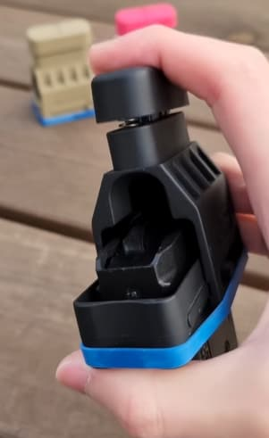

# SPTarkovSpeedLoader
magazine speed-loader for SPTarkov

will increase magazine's ammo load speed when your special slot have any **Leatherman Multitool**

the initial idea was to add a new item, but i didn't have the necessary skills that to made a new 3D model

### coefficient
when: 
- default server settings (0.85 second)
- Mag Drills Lv.9 (-5.4% modify)
- the magazine is 6L31 (60 round 5.45x39 that with +85% modify)

the base coefficient is `0.85 * (1.0 - 0.054 + 0.85)` => `1.5266`

each tool provides 75% speed coefficient, use multiplication instead of addition

|tool count|final speed|
|---|---|
|0|1.52 second|
|1|1.14 second|
|2|0.85 second|
|3|0.64 second|

### source of idea
